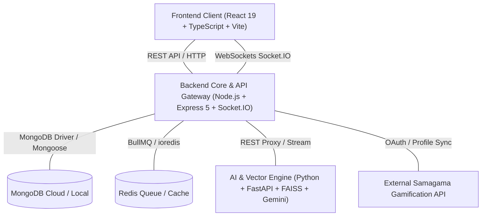

# 🎓 CSFAQ — Yaksha AI Knowledge Platform & FAQ Crowdsourcing Hub

<div align="center">


*An enterprise-grade, gamified AI knowledge management and crowdsourced FAQ platform engineered to streamline internship onboarding, automated triage, and community mentorship.*

</div>

---

## ✨ Executive Summary

The **CSFAQ (Yaksha AI Knowledge Platform)** is a state-of-the-art, tri-tier system designed to bridge human-curated documentation with cutting-edge **Retrieval-Augmented Generation (RAG)**. Built to resolve onboarding bottlenecks and streamline knowledge transfer in fast-paced internship environments, the platform pairs an intelligent AI assistant (**Yaksha**) with automated human triage, real-time WebSocket synchronization, gamified contribution tracking, and enterprise-grade administrative security.

---

## 🚀 Highlighting Key Features & Team Contributions

### 🤖 1. Redesigned Yaksha AI Assistant with RAG & Vector Optimization
* **RAG Pipeline**: Powered by a dedicated **Python FastAPI microservice**, Yaksha combines MongoDB full-text indexing (`$text` search) with semantic vector retrieval.
* **Vector Database Optimization**: Utilizes **FAISS (`faiss-cpu`)** vector indexing with HuggingFace `sentence-transformers` (`all-MiniLM-L6-v2`, 384-dimensional embeddings) and Google Gemini (`gemini-2.5-flash`) for ultra-low latency semantic matching.
* **Live Token Streaming & Telemetry**: Delivers real-time token streaming over **Socket.IO / Server-Sent Events (SSE)** with built-in confidence scoring (High/Medium/Low) and automated prompt sanitization against malicious payloads.

### ⚖️ 2. AI & Human Hybrid Search & Escalation Triage
* **Automated Query Escalation**: When Yaksha AI encounters a question with low confidence or missing knowledge base coverage, the system automatically escalates the unresolved query to the **Human Triage Queue**.
* **Smart Priority Tagging**: Escalated questions are automatically tagged with priority tiers (`Low`, `Medium`, `High`) based on semantic urgency and user impact, ensuring critical onboarding blockers are solved immediately by human moderators and domain experts.

### 🏗️ 3. Tri-Tier Enterprise Architecture (MERN + Python Microservice)
* **Frontend Client (`/client`)**: Built with **React 19, TypeScript, and Vite**, featuring Tailwind CSS, Lucide Icons, Framer Motion animations, Redux Toolkit state persistence, and TanStack React Query.
* **Core API Gateway (`/server`)**: **Node.js + Express 5** server running ES modules, Mongoose ODM, BullMQ / Redis job queues, and advanced security (Helmet, CORS, Rate Limiting, Mongo Sanitize).
* **AI Engine (`/ai-engine`)**: Python FastAPI server handling PDF document ingestion (`pypdf`), sliding-window text chunking, and FAISS index persistence (`faiss_index.bin`).

### 🎮 4. Gamified Learning Dashboard & Interactive Study Break
* **GitHub-Style Interaction Volume**: A dynamic contribution grid that tracks daily study sessions, resolved queries, and knowledge base interactions—styled exactly like a developer's GitHub commit graph.
* **🕹️ Secret Study Break Game (Pac-Man)**: 
  * Need a quick mental refresher? Click the **"Interaction Volume"** title **5 times** to collapse the contribution grid into a retro **Pac-Man Mini-Game**!
  * Engineered with integer-based collision math, custom academic UI styling, responsive touch/keyboard controls, and an automated 5-minute study timer that alerts users when break time is over: *"Break Over! Go Study!"*
* **Samagama / Spurti Points Integration**: Earn and spend reward points (**Spurti Points**) for active learning, upvoting answers, and resolving FAQ queries. Includes an automated deterministic simulation fallback for seamless local testing.

### 🛡️ 5. Advanced Admin-User Handling & Security Controls
* **Role-Based Access Control (RBAC)**: Strict multi-layer authentication distinguishing between Registered Users, Moderators, and Super Admins.
* **Instant Suspension & Rollback**: Admins can suspend or unsuspend users with a single click. Suspended users are immediately logged out via real-time **WebSocket disconnect events** and greeted with explicit login notifications.
* **Irreversible MongoDB Data Wipe**: A permanent user deletion feature safeguarded by an executive confirmation modal warning that cleanly scrubs all user credentials, session tokens, registered devices, query histories, and audit logs from MongoDB.
* **Immutable Audit Trails**: Automatically logs administrative overrides, authentication events, and system mutations with IP tracking (`AuditLog` schema).

### 🔍 6. Global Search Bar & Command Palette
* **Omnipresent Search**: A responsive global search bar that allows users and admins to instantly search across published FAQs, knowledge base categories, unresolved queries, and application menus from anywhere in the platform.

---

## 🏛️ System Architecture



---

## 🗄️ Core Database Schema Specifications (MongoDB)

| Model Name | Key Fields & Types | Purpose & Indexing Strategy |
| :--- | :--- | :--- |
| **`User`** | `name` (String), `email` (String, Unique), `password` (Hashed), `role` (ObjectId -> Role), `accountStatus` (Enum), `spurtiPoints` (Number) | Core identity, authentication, RBAC, and reward balance tracking. |
| **`FAQ`** | `question` (String), `answer` (String), `slug` (String, Unique), `category` (ObjectId -> Category), `tags` ([ObjectId]), `helpfulCount` (Number), `approvalStatus` (Enum) | Main knowledge base entities. Full-text indexed on question, answer, and tags. |
| **`Category`** | `name` (String), `slug` (String), `parent` (ObjectId -> Category), `description` (String) | Hierarchical taxonomy for organizing FAQs into nested trees and modules. |
| **`Query`** | `user` (ObjectId -> User), `question` (String), `status` (Pending/Resolved/Dismissed), `priority` (Low/Medium/High), `response` (String) | Crowdsourced unresolved questions escalated from AI triage awaiting human resolution. |
| **`Conversation`** | `user` (ObjectId -> User), `title` (String), `messages` ([{role, content, timestamp}]), `totalTokens` (Number), `status` (active/archived) | Persistent multi-turn AI chat histories between users and Yaksha AI. |
| **`Bookmark`** | `user` (ObjectId -> User), `faq` (ObjectId -> FAQ), `note` (String), `folder` (String) | Personal user libraries and saved knowledge documentation snippets. |
| **`Redemption`** | `user` (ObjectId -> User), `title` (String), `cost` (Number), `code` (String, Unique), `used` (Boolean) | Tracked reward claims purchased using accumulated Spurti Points. |
| **`AuditLog`** | `user` (ObjectId), `action` (String), `resource` (String), `ipAddress` (String), `metadata` (Object) | Immutable system security logs and user activity audit trails. |

---

## 📦 Installation & Local Development Setup

### Prerequisites
* **Node.js** (v18+ recommended)
* **Python** (v3.10+ recommended)
* **MongoDB** (Local instance running on port 27017 or MongoDB Atlas Cloud URI)
* **Redis** (Optional, required for BullMQ background job queues)

### 1. Clone the Repository
```bash
git clone https://github.com/Hritam2005/csfaq.git
cd csfaq
```

### 2. Configure Environment Variables
Create `.env` files across all three architectural tiers based on their respective `.env.example` templates:

#### API Gateway (`server/.env`)
```env
PORT=5000
MONGODB_URI=mongodb://localhost:27017/csfaq
JWT_SECRET=your_super_secret_jwt_key_here
CLIENT_URL=http://localhost:3000
REDIS_HOST=127.0.0.1
REDIS_PORT=6379
AI_ENGINE_URL=http://localhost:8000
```

#### Frontend Client (`client/.env`)
```env
VITE_API_BASE_URL=http://localhost:5000/api/v1
VITE_SOCKET_URL=http://localhost:5000
```

#### AI Engine (`ai-engine/.env`)
```env
PORT=8000
GEMINI_API_KEY=your_google_gemini_api_key_here
FAISS_INDEX_PATH=./faiss_index.bin
```

### 3. Launch the Application Tiers

#### Step A: Start the Python AI Engine Microservice
```bash
cd ai-engine
python -m venv venv
# On Windows:
.\venv\Scripts\activate
# On Linux/macOS:
source venv/bin/activate

pip install -r requirements.txt
python main.py
```
*The AI vector microservice will start on `http://localhost:8000`.*

#### Step B: Start the Node.js API Gateway Server
```bash
cd server
npm install
npm run dev
```
*The API Gateway and Socket.IO server will start on `http://localhost:5000`.*

#### Step C: Start the React Frontend Client
```bash
cd client
npm install
npm run dev
```
*The web interface will launch on `http://localhost:3000`.*

---

## 👥 Project Leadership & Team Contributions

* **Hritam Das** — *Project Lead & Core Systems Architect*
* **Team-6a2e9c7620d795c324f97424** — *Full-Stack Development, AI RAG Pipeline, Gamification Design, & Quality Assurance*

---
<div align="center">
  <sub>Built with ❤️ by Team-6a2e9c7620d795c324f97424 for empowering collaborative education, intelligent mentorship, and technical onboarding.</sub>
</div>
