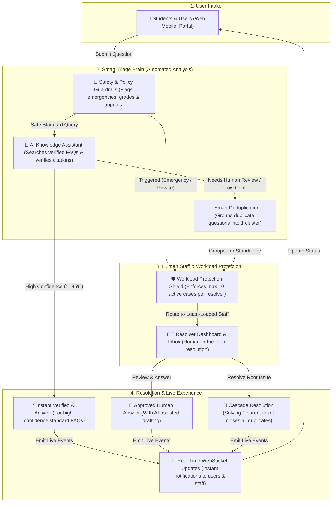
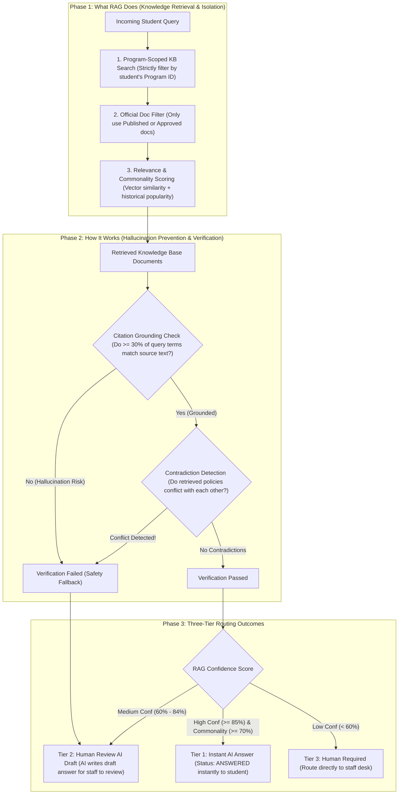
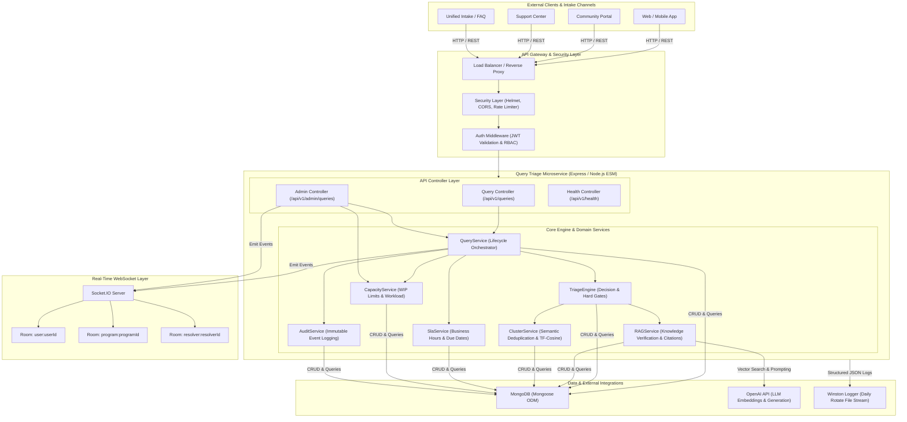
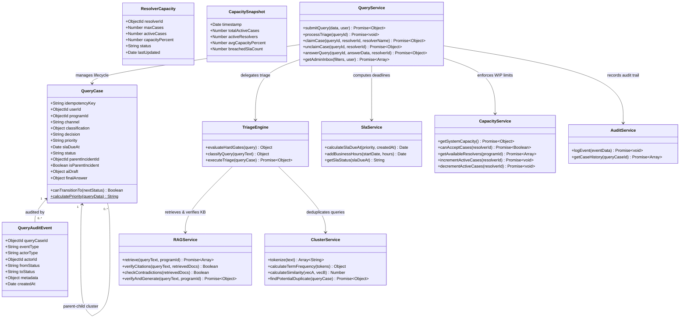
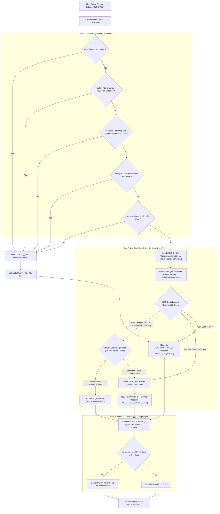
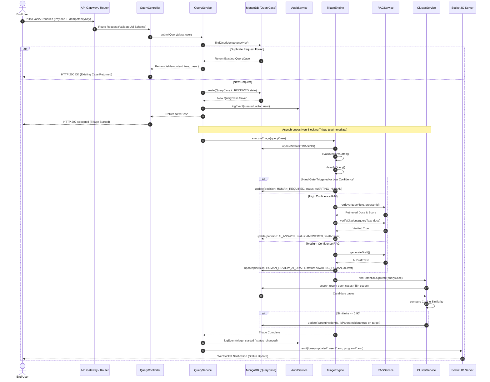
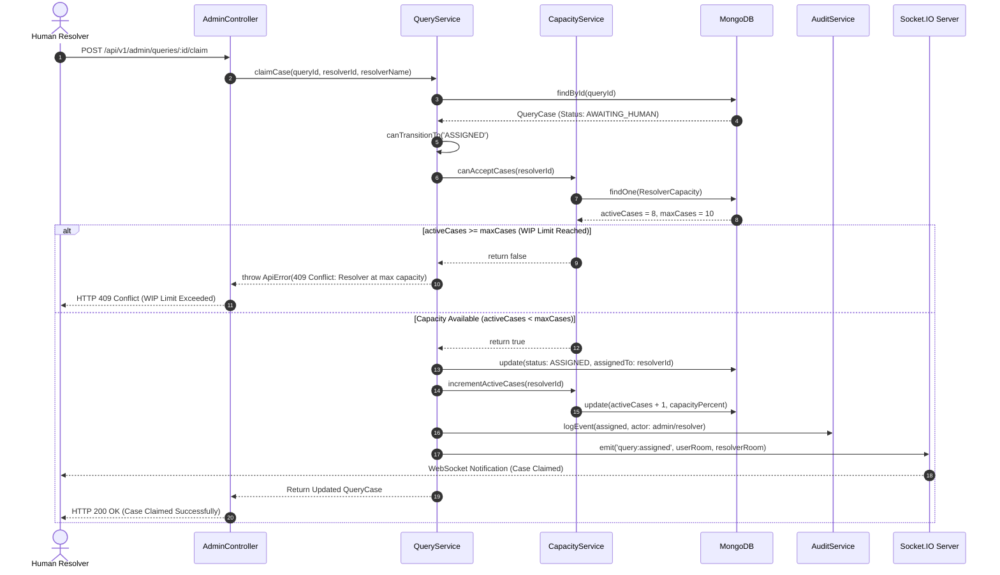
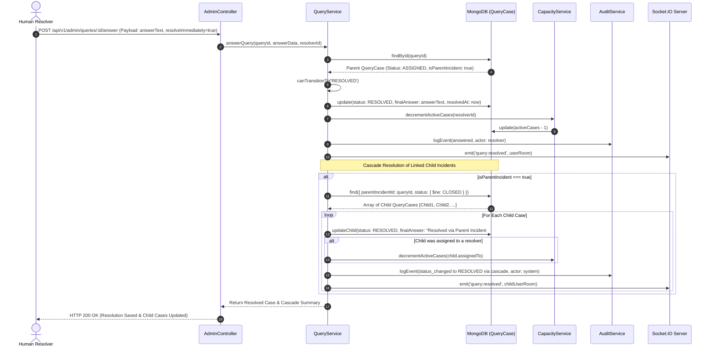

# 🏗️ Query Triage Microservice: Exhaustive Architecture & UML Diagrams

This document provides a complete suite of **UML and Architectural Diagrams** for the **Query Triage Microservice** (`@csfaq/query-triage`). It is designed to enable engineers, architects, and developers to rapidly understand both the high-level conceptual flow and the exhaustive internal mechanics, domain models, decision workflows, and real-time event orchestration of the system.

---

## 📑 Table of Contents
1. [High-Level Conceptual Architecture (10,000-Foot View)](#1-high-level-conceptual-architecture-10000-foot-view)
2. [RAG Knowledge Engine: What It Does & How It Works](#2-rag-knowledge-engine-what-it-does--how-it-works)
3. [Detailed System Architecture & Component Topology](#3-detailed-system-architecture--component-topology)
4. [Domain Class Diagram & Service Relationships](#4-domain-class-diagram--service-relationships)
5. [Query Triage Decision Tree Flowchart](#5-query-triage-decision-tree-flowchart)
6. [Sequence Diagram: Query Submission & Asynchronous Triage](#6-sequence-diagram-query-submission--asynchronous-triage)
7. [Sequence Diagram: Resolver Claim & Workload WIP Enforcement](#7-sequence-diagram-resolver-claim--workload-wip-enforcement)
8. [Sequence Diagram: Case Resolution & Cascade Incident Closing](#8-sequence-diagram-case-resolution--cascade-incident-closing)

---

## 1. 🌟 High-Level Conceptual Architecture (10,000-Foot View)

This diagram provides an easily understandable, high-level overview of how the microservice operates. It breaks the system down into four intuitive stages: **User Intake**, the automated **Smart Triage Brain**, **Human Staff Protection**, and **Live Resolution**. 

### 💡 Why this design works:
1. **Safety First**: Before AI is even consulted, strict rules check for emergencies or private student data (attendance, fees, marks). If found, a human is assigned immediately.
2. **AI with Proof**: AI only answers if it finds verified university policies and can prove at least 30% citation grounding. Otherwise, it drafts an answer for human approval.
3. **No Duplicate Work**: If 50 students ask about the same campus outage or exam schedule, **Smart Deduplication** groups them together. Staff answer once, and **Cascade Resolution** automatically solves all 50 tickets!
4. **Zero Burnout**: The **Workload Protection Shield** ensures no staff member is ever overloaded with more tickets than their defined capacity limit.

---

## 2. 🤖 RAG Knowledge Engine: What It Does & How It Works

The **Retrieval-Augmented Generation (RAG)** engine (`RAGService`) is the core AI intelligence of the microservice. This diagram illustrates exactly **what RAG is doing** to search the university knowledge base and **how it works** to eliminate AI hallucinations before routing answers to students or staff.

### 🔍 Deep-Dive: What RAG is Doing vs. How It Works

#### What RAG is Doing (Retrieval & Filtering):
- **Multi-Tenant Knowledge Isolation**: When a query arrives, RAG never searches a global bucket. It strictly scopes retrieval to the student's specific `programId` (e.g., Computer Science vs. Business Administration), ensuring policy cross-contamination is impossible.
- **Editorial Quality Control**: It filters out draft or outdated documents, searching exclusively within official FAQs and policy handbooks marked as `published` or `approved`.
- **Hybrid Scoring**: It ranks retrieved documents by combining vector semantic similarity with **Commonality Scoring** (how frequently a specific policy document has historically resolved similar student issues).

#### How It Works (Hallucination Prevention & Safety Routing):
To prevent the Large Language Model (LLM) from inventing fake university rules or guessing answers, the RAG engine enforces two mandatory mathematical checks:
1. **Citation Grounding Check (The 30% Rule)**: The engine extracts key vocabulary terms ($>3$ characters) from the student's question and verifies that **at least 30% of those exact terms physically exist** inside the retrieved official documents. If an LLM tries to answer from general pre-training rather than official university text, this check fails!
2. **Contradiction Detection**: If multiple retrieved policy documents contain conflicting statements (e.g., Document A says "fee deadline is Friday" while Document B says "deadline is Monday"), the system detects the contradiction and aborts automatic answering.
3. **Three-Tier Safety Routing**:
   - **Tier 1 (Instant AI Answer)**: When confidence is $\ge 85\%$, commonality is high, citations are verified, and no contradictions exist, the AI delivers an instant, verified answer to the student.
   - **Tier 2 (AI Draft for Human Review)**: When confidence is moderate ($60\% - 84\%$) or if citation grounding fails, the AI writes a **Draft Answer** (`aiDraft`) behind the scenes. The student does not see it; instead, the ticket routes to human staff who can review, edit, and approve the AI's draft in one click.
   - **Tier 3 (Human Required)**: When confidence is low ($< 60\%$), the AI steps aside entirely and routes the ticket straight to human staff.

---

## 3. 🌐 Detailed System Architecture & Component Topology

The diagram below illustrates the comprehensive technical architecture of the `@csfaq/query-triage` microservice. It highlights the boundary layers between external client channels, the API gateway, core Express middlewares, domain services, real-time WebSocket rooms, and data persistence layers.

### Key Technical Highlights:
- **Human-First Triage Paradigm**: AI is utilized as a high-speed drafting and classification assistant, but hard safety and operational gates enforce human verification for sensitive queries.
- **Asynchronous Non-Blocking Processing**: Heavy AI/RAG retrieval, vector similarity calculations, and clustering run asynchronously in background event loops (`setImmediate`), allowing the submission endpoint to respond instantly with `202 Accepted`.
- **Work-In-Progress (WIP) Protection**: The system actively protects human resolvers from burnout by enforcing strict active case ceilings (e.g., max 10 active cases) and pull-based routing.

---

## 4. 🧩 Domain Class Diagram & Service Relationships

This class diagram models the core domain entities (`QueryCase`, `QueryAuditEvent`, `ResolverCapacity`, `CapacitySnapshot`) and their interactions with stateless business logic services.

---

## 5. 🔀 Query Triage Decision Tree Flowchart

The flowchart below traces the exact decision path executed by the `TriageEngine` when a newly submitted query enters the `TRIAGING` state. It demonstrates how **Hard Human Gates**, **RAG Confidence Scoring**, and **Semantic Clustering** determine the final routing decision.

---

## 6. ⚡ Sequence Diagram: Query Submission & Asynchronous Triage

This sequence diagram details the end-user query submission lifecycle. It highlights the **idempotency check**, immediate HTTP `202 Accepted` response, and the non-blocking background execution of the triage pipeline.

---

## 7. 🛡️ Sequence Diagram: Resolver Claim & Workload WIP Enforcement

This sequence diagram illustrates how admin/resolvers claim tickets from the triage queue. It demonstrates how `CapacityService` acts as a protective shield against burnout by checking real-time Work-In-Progress (WIP) limits before permitting a state transition to `ASSIGNED`.

---

## 8. 🌊 Sequence Diagram: Case Resolution & Cascade Incident Closing

This sequence diagram depicts the resolution workflow. Crucially, when a resolver answers a **Parent Incident** (`isParentIncident === true`), the system executes a **Cascade Resolution**, automatically closing all linked duplicate child tickets and freeing up workload capacity across the resolver pool.

---
*Created by Antigravity AI Coding Assistant for Samagama / CSFAQ Query Triage Microservice.*
