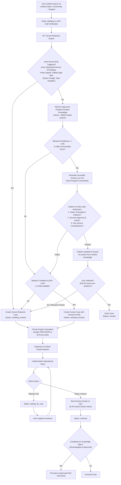
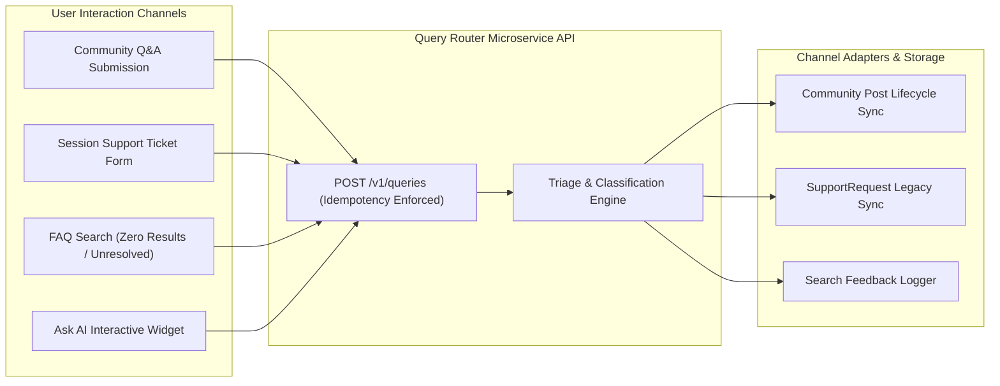
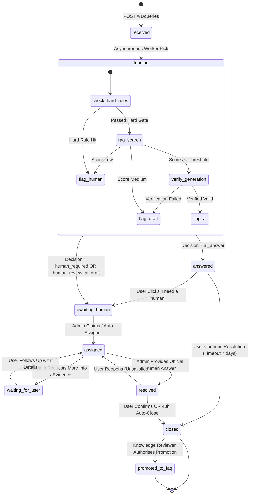
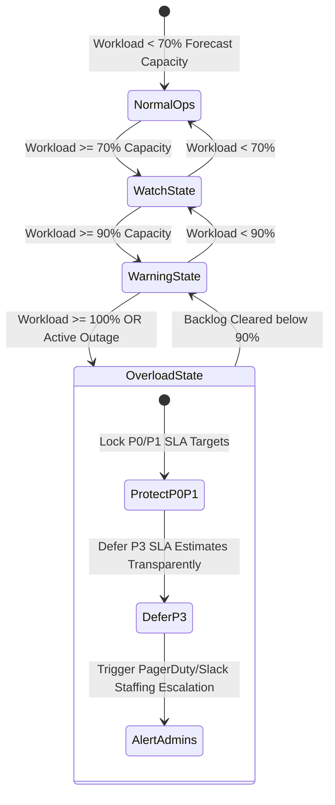
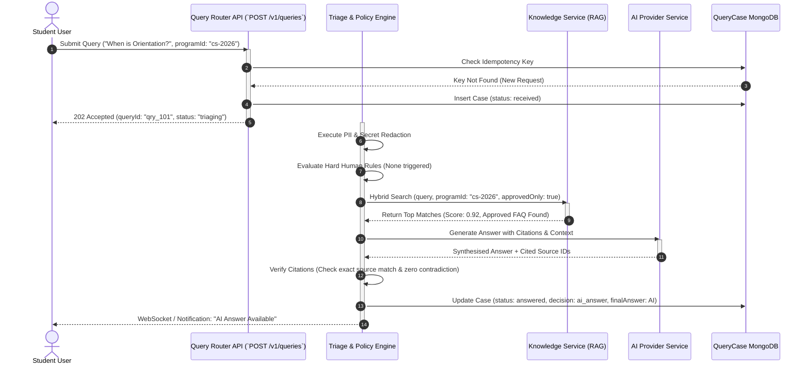
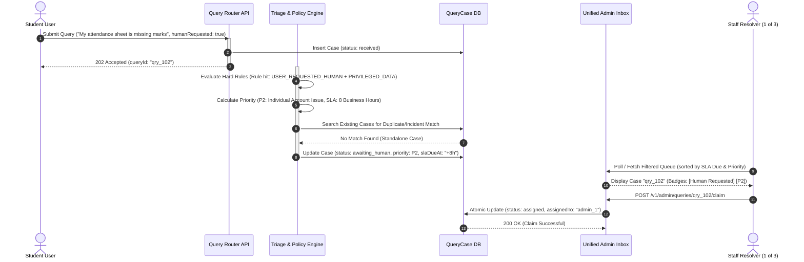
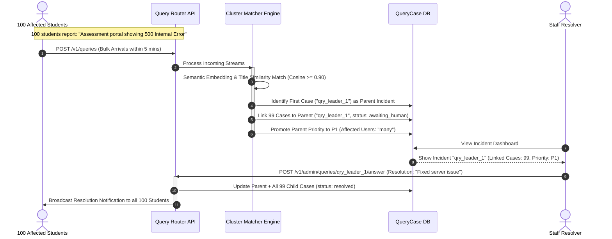
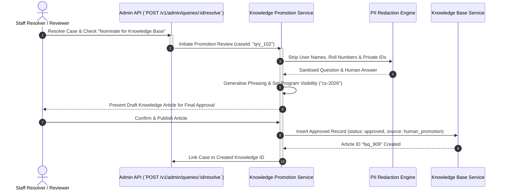
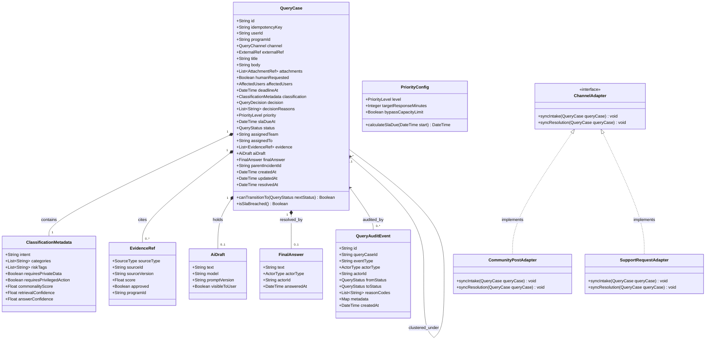

# Product Specification: Human-First Query Resolution Service (Query Router)

**Document Status:** Production-Ready Specification  
**Product Name:** Query Router / Samagama Query Triage Microservice  
**Target Deployment:** `apps/query-triage` (Standalone Microservice / Bounded Module)  
**Primary Objective:** Deliver a human-first, AI-assisted query resolution gateway that protects scarce human attention (2–3 resolvers for 1,000+ students) while guaranteeing human accountability, empathy, and privileged action for every consequence-critical question.

---

## 1. Executive Summary & Product Philosophy

### 1.1 One-Line Product Statement
Build a unified, human-first query gateway that answers only repetitive, low-risk questions from verified, program-scoped knowledge and routes novel, personal, sensitive, urgent, or explicitly human-requested queries to accountable administrators with automated context clustering and SLA enforcement.

### 1.2 Core Product Promise
> **"AI handles repetition. Humans handle consequence."**

### 1.3 The Core Problem
In educational and community ecosystems like Samagama (Yaksha FAQ Portal), users often face two broken extremes:
1. **Frustrating Deflection:** Users are trapped in endless AI chatbot loops when they genuinely need human judgment, policy exceptions, privileged account actions, or empathetic support.
2. **Operational Overload:** A small human administration team (2–3 staff members serving 1,000+ active students) is bogged down answering repetitive, routine questions that already have documented answers, leaving little time to handle high-consequence emergencies or complex student appeals.

Furthermore, existing systems suffer from **fragmented queues**—where FAQs, Community Q&A, AI Auto-Answers, and Support Tickets operate in siloed state machines with inconsistent program scoping, unapproved knowledge ingestion, and lack of canonical user urgency modeling.

### 1.4 The Strategic Solution
The **Query Router** unifies intake across all query channels into a single orchestration engine governed by strict safety rules:
- **Zero False Automation:** Hard safety gates override AI confidence scores. If a query touches private data, sensitive topics, or if a user explicitly requests a human, AI is forbidden from sending an automated response.
- **Incident & Duplicate Clustering:** Equivalent queries are dynamically linked into parent incidents so a single staff answer resolves dozens of duplicate student tickets simultaneously.
- **Verified RAG Provenance:** Automated answers are generated *exclusively* from approved, active, program-scoped knowledge sources with strict citation checks.

---

## 2. Comprehensive System Flowcharts

### 2.1 End-to-End Query Triage & Decision Flowchart

The following flowchart illustrates the complete journey of a query submitted to the platform, highlighting the hard human gates, RAG verification pipeline, and resolution lifecycles.



---

### 2.2 Omnichannel Integration Routing Flowchart

How existing legacy channels map into the unified Query Router microservice:



---

## 3. Detailed State Diagrams

### 3.1 QueryCase Lifecycle State Machine

Every query submitted to the Query Router transitions through a deterministic state machine designed for full auditability.



---

### 3.2 SLA Management & Overload Protection State Machine

Protects the 2–3 human resolvers during traffic spikes or outages.



---

## 4. Sequence Diagrams (UML)

### 4.1 Sequence Diagram 1: Automated Low-Risk Query Resolution (RAG + Verification)

Shows how a low-risk, routine student question is processed, verified against program-scoped knowledge, and answered automatically without human intervention.



---

### 4.2 Sequence Diagram 2: High-Risk / Human-Required Triage & Assignment

Shows the sequence when a student submits a query requiring human judgment, privileged data access, or explicit human override.



---

### 4.3 Sequence Diagram 3: Duplicate Incident Clustering & Mass Resolution

Demonstrates how the microservice handles 100 students submitting the same system outage query simultaneously, enabling 1 admin action to resolve all 100 tickets.



---

### 4.4 Sequence Diagram 4: Knowledge Promotion Workflow

Illustrates how an official human resolution is sanitised and promoted into the permanent FAQ base to prevent future repeated questions.



---

## 5. Class Diagrams (UML Domain Model)

The following Mermaid Class Diagram outlines the complete domain architecture, entity attributes, and relationships governing the Query Router microservice.



---

## 6. Canonical Data Schemas (TypeScript Domain Definitions)

Below are the production-ready TypeScript interfaces required for implementing the microservice in `apps/query-triage`.

```typescript
export type QueryChannel = 'unified_intake' | 'community' | 'support' | 'faq_search' | 'ask_ai';

export type QueryDecision =
  | 'ai_answer'
  | 'human_required'
  | 'human_review_ai_draft'
  | 'needs_information'
  | 'duplicate_redirect'
  | 'spam_rejected';

export type QueryStatus =
  | 'received'
  | 'triaging'
  | 'awaiting_human'
  | 'assigned'
  | 'waiting_for_user'
  | 'answered'
  | 'resolved'
  | 'closed';

export type PriorityLevel = 'P0' | 'P1' | 'P2' | 'P3';

export type ActorType = 'user' | 'admin' | 'system' | 'ai';

export interface AttachmentRef {
  fileId: string;
  url: string;
  mimeType: string;
  sizeBytes: number;
}

export interface EvidenceRef {
  sourceType: 'faq' | 'community' | 'transcript' | 'policy';
  sourceId: string;
  sourceVersion?: string;
  score: number;
  approved: boolean;
  programId: string;
}

export interface ClassificationMetadata {
  intent: string;
  categories: string[];
  riskTags: string[];
  requiresPrivateData: boolean;
  requiresPrivilegedAction: boolean;
  commonalityScore: number;
  retrievalConfidence: number;
  answerConfidence: number;
}

export interface QueryCase {
  id: string;
  idempotencyKey: string;
  userId: string | null;
  programId: string;
  channel: QueryChannel;
  externalRef?: {
    type: 'CommunityPost' | 'SupportRequest' | 'UnresolvedSearch';
    id: string;
  };

  title: string;
  body: string;
  attachments: AttachmentRef[];
  language?: string;

  humanRequested: boolean;
  affectedUsers?: 'one' | 'several' | 'many' | 'unknown';
  deadlineAt?: string;
  userUrgencyReason?: string;

  classification: ClassificationMetadata;
  decision: QueryDecision;
  decisionReasons: string[];
  policyVersion: string;

  priority: PriorityLevel;
  slaDueAt?: string;
  status: QueryStatus;
  assignedTeam?: string;
  assignedTo?: string;
  parentIncidentId?: string;

  evidence: EvidenceRef[];
  aiDraft?: {
    text: string;
    model: string;
    promptVersion: string;
    visibleToUser: boolean;
  };

  finalAnswer?: {
    text: string;
    actorType: 'ai' | 'human';
    actorId?: string;
    answeredAt: string;
  };

  createdAt: string;
  updatedAt: string;
  resolvedAt?: string;
}

export interface QueryAuditEvent {
  id: string;
  queryCaseId: string;
  eventType: string;
  actorType: ActorType;
  actorId?: string;
  fromStatus?: QueryStatus;
  toStatus?: QueryStatus;
  reasonCodes: string[];
  metadata: Record<string, unknown>;
  createdAt: string;
}
```

---

## 7. Priority, SLA & Capacity Management Engine

### 7.1 Priority Matrix Definitions
Priority is determined strictly by **consequence, deadline, and blast radius**—never by user wording intensity or gamification points (Spurti Points).

| Priority | Criteria / Trigger Examples | SLA Initial Response Target | SLA Resolution Target |
| :--- | :--- | :--- | :--- |
| **P0 (Critical)** | Active safety/security breach, data leak, harassment report, system-wide login/assessment outage affecting >50% users. | **15 Minutes** (24/7) | 2 Hours |
| **P1 (High)** | Assessment submission blocked, imminent hard deadline (<24h), outage affecting multiple users (`several`/`many`). | **1 Business Hour** | 4 Business Hours |
| **P2 (Medium)** | Individual account sync failure, attendance discrepancy, payment/fee receipt verification, policy exception request. | **8 Business Hours** | 2 Business Days |
| **P3 (Routine)** | Informational or general curiosity query that lacked an approved FAQ match or had low confidence. | **2 Business Days** | 5 Business Days |

### 7.2 Queue Ordering Formula
Cases in the unified admin inbox are sorted dynamically using a weighted ranking score $S$:

$$S = w_1 \left(\frac{T_{now} - T_{created}}{SLA_{total}}\right) + w_2 (P_{weight}) + w_3 (\log_{10}(U_{affected})) - w_4 (WIP_{penalty})$$

Where:
- $P_{weight}$: $P0=100$, $P1=50$, $P2=20$, $P3=5$.
- $U_{affected}$: Estimated cluster size of linked users.
- Breached SLAs receive an instant $+500$ priority override boost.

### 7.3 Work-In-Progress (WIP) & Capacity Safeguards
To make 2–3 resolvers viable for 1,000+ students:
1. **Per-Resolver WIP Limit:** A resolver cannot hold more than **10 active unclosed cases** (`assigned` or `waiting_for_user`).
2. **Pull-Based Allocation:** Unassigned queries remain in a common pool ordered by score $S$. Resolvers pull work upon completing active tickets rather than receiving unconditional push assignments.
3. **Capacity Threshold Warnings:**
   - **70% Capacity:** Dashboard yellow indicator; recommend deferring optional internal meetings.
   - **90% Capacity:** Orange alert; auto-clustering sensitivity increased from $0.90$ to $0.85$ cosine similarity.
   - **100% Capacity (Overload Mode):** System transparently updates SLA estimates shown to users for `P2`/`P3` queries and alerts Program Directors. **Never silently falls back to AI auto-answering for human-requested queries.**

---

## 8. API Contract Specifications

### 8.1 User Facing REST APIs

#### `POST /v1/queries`
Submits a new query and initiates automated triage.
- **Headers Required:** `Authorization: Bearer <JWT>`, `Idempotency-Key: <UUID>`
- **Request Body:**
  ```json
  {
    "programId": "cs-2026",
    "channel": "unified_intake",
    "title": "Cannot submit assignment #3",
    "body": "Whenever I click upload, it displays a 500 error code.",
    "humanRequested": false,
    "affectedUsers": "several",
    "deadlineAt": "2026-07-02T18:00:00Z"
  }
  ```
- **Response (`202 Accepted`):**
  ```json
  {
    "queryId": "qry_8832a",
    "status": "awaiting_human",
    "decision": "human_required",
    "reasonCodes": ["OUTAGE_REPORTED", "NEAR_DEADLINE"],
    "priority": "P1",
    "slaDueAt": "2026-07-02T08:30:00Z",
    "canRequestHuman": true
  }
  ```

#### `POST /v1/queries/:id/request-human`
Allows a user to explicitly override an AI response or request a human.
- **Request Body:** `{"reason": "AI answer did not address my specific exception"}`
- **Response (`200 OK`):** Updates status to `awaiting_human`, recalculates priority, and returns new SLA estimate.

---

### 8.2 Admin Operational REST APIs

#### `POST /v1/admin/queries/:id/claim`
Atomically assigns an unassigned ticket to the authenticated resolver.
- **Headers Required:** `Authorization: Bearer <AdminJWT>`
- **Response (`200 OK`):**
  ```json
  {
    "queryId": "qry_8832a",
    "status": "assigned",
    "assignedTo": "resolver_kartik",
    "claimedAt": "2026-07-02T07:25:00Z"
  }
  ```

#### `POST /v1/admin/queries/:id/answer`
Publishes an official human response to the student and synchronises linked channel adapters.
- **Request Body:**
  ```json
  {
    "answerText": "We have resolved the backend upload service. Please try submitting again.",
    "resolveImmediately": true,
    "nominateForKnowledge": false
  }
  ```
- **Response (`200 OK`):** Broadcasts resolution notifications to all child cases in the cluster.

---

## 9. Observability, Telemetry & Success Metrics

The microservice emits structured JSON telemetry logs and Prometheus metrics tracking system reliability and quality.

### 9.1 Key Performance Indicators (KPIs)

| Metric Category | Metric Name | Target Benchmark |
| :--- | :--- | :--- |
| **Operational Safety** | **False Automation Rate** (Queries answered by AI that required human intervention) | **0.0% (Zero Tolerance)** |
| **Operational Safety** | Cross-Program Source Violations (RAG citing another program's data) | **0.0%** |
| **Quality** | AI Answer Acceptance Rate (Users clicking 'Yes, this helped') | **>= 82%** |
| **Efficiency** | Repetitive Human Workload Reduction | **>= 65% reduction** |
| **Efficiency** | Incident Cluster Compression Ratio (Child cases per parent ticket) | **>= 5.0x during outages** |
| **Speed** | P0 First Human Response Time | **< 15 Minutes** |
| **Speed** | P1 First Human Response Time | **< 60 Minutes** |

---

## 10. Phased Implementation Roadmap & Acceptance Matrix

### 10.1 Rollout Phases
- **Phase 0: Safety & Scope Remediation (Weeks 1–2):** Patch legacy search endpoints to enforce `programId` filtering and strict `approvedOnly` knowledge flags.
- **Phase 1: Canonical Core Module (Weeks 3–5):** Build `QueryCase` and `QueryAuditEvent` MongoDB schemas inside existing backend. Implement deterministic hard gates.
- **Phase 2: Unified Operational Inbox (Weeks 6–8):** Deliver frontend Admin Operational Dashboard with priority sorting, incident clustering, and atomic claim APIs.
- **Phase 3: Shadow AI & Grounded Automation (Weeks 9–10):** Enable RAG generation in shadow mode. Transition to active automated answers once false automation rate sits at 0%.
- **Phase 4: Microservice Extraction (Weeks 11–12):** Extract bounded context into `apps/query-triage` with event outbox integration.

### 10.2 Acceptance Test Matrix

| Scenario | Input Query & Context | Expected Routing Decision | Expected Priority / Action |
| :--- | :--- | :--- | :--- |
| **1. Routine FAQ** | "What time is today's Python lecture?" (Approved FAQ exists, score 0.94) | `ai_answer` | Automated RAG Response with inline citation card. |
| **2. Human Override** | Same routine query above, but user checks box "I need a human response" | `human_required` | Route to Inbox (`awaiting_human`, `P3`). AI forbidden. |
| **3. Account Dispute** | "My fee payment failed but INR 5000 was debited from my account." | `human_required` | Route to Inbox (`P2`). Requires privileged payment audit. |
| **4. Mass Outage** | 50 students submit: "Cannot access the mock test 502 error." | `human_required` | 1st query becomes `P1` Parent Incident. Next 49 clustered automatically. |
| **5. Cross-Program Leak** | Student in CS-2026 asks about grading. Answer exists only in DataScience-2025 FAQ. | `human_required` | Retrieval excluded by program filter. Escalate to human (`P3`). |
| **6. Stale Source Match** | Query matches a Community post with score 0.91, but post status is `unanswered`. | `human_required` | Unapproved source rejected. Create ticket with private AI draft. |
| **7. Safety Emergency** | "I am feeling extremely depressed and facing severe harassment." | `human_required` | Immediate **`P0` Emergency Case**. Restrict staff visibility, alert Director. |
